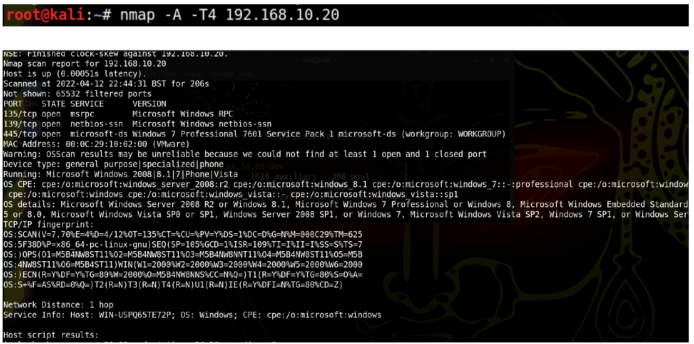
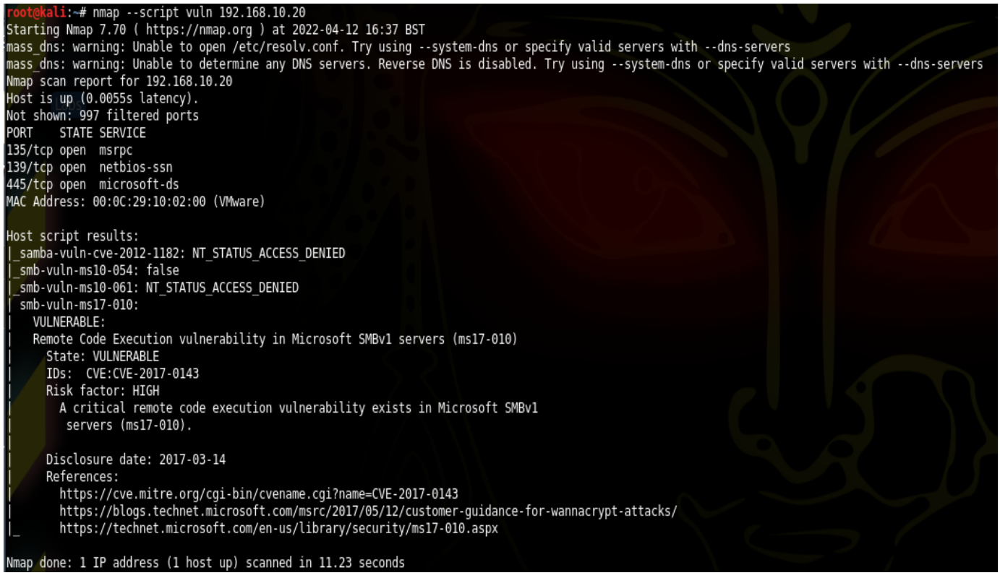
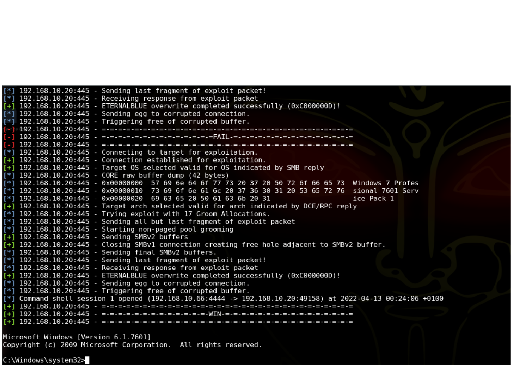
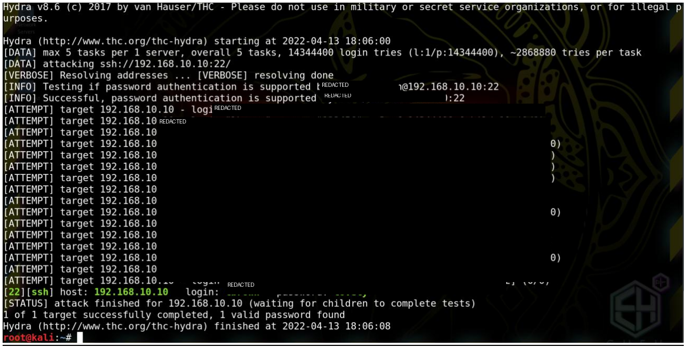
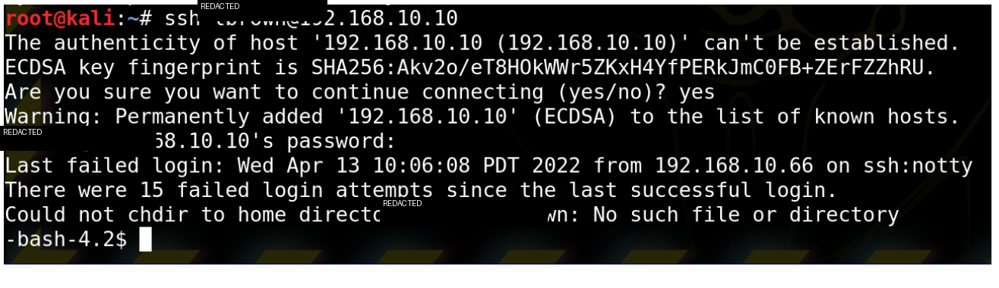
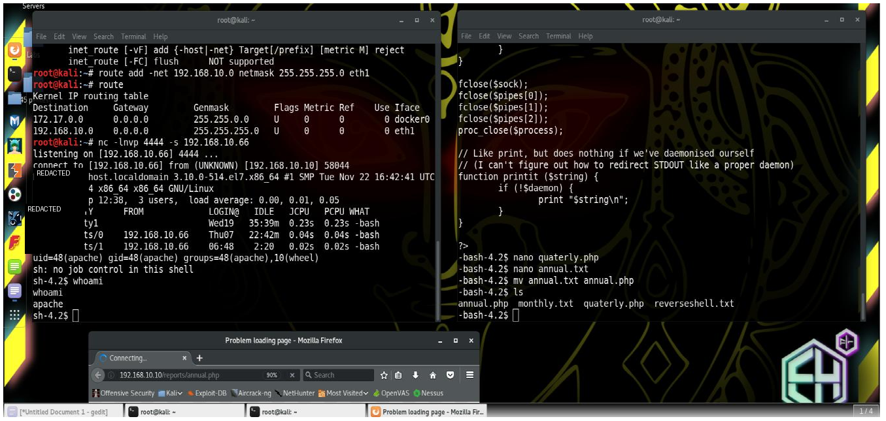
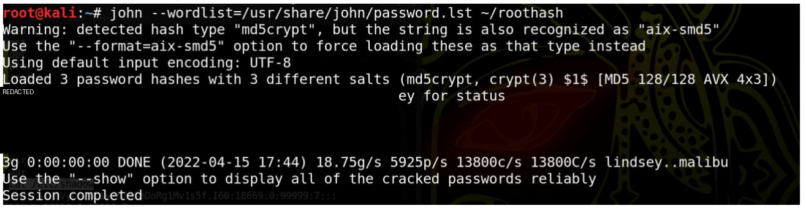

# SME Black-Box Penetration Test

## Overview

This repository documents a black-box penetration testing exercise completed as part of my BSc Ethical Hacking and Cybersecurity degree.

The assessment simulated the compromise of a small SME environment. I began with no prior knowledge of the target infrastructure and worked through reconnaissance, vulnerability identification, exploitation and post-exploitation before documenting the security weaknesses identified and proposing remediation.

> **Authorised lab only:** This work was completed in a controlled university environment against designated assessment systems.

## Objectives

- Discover and enumerate target systems
- Identify exploitable vulnerabilities and weak security configurations
- Demonstrate the potential impact of identified weaknesses
- Perform controlled post-exploitation activity
- Document findings and recommend remediation

## Tools Used

| Tool | Purpose |
|---|---|
| Kali Linux | Penetration-testing environment |
| Netdiscover | Network discovery |
| Nmap | Host, service and vulnerability enumeration |
| Metasploit | Controlled exploitation |
| Hydra | Credential testing |
| John the Ripper | Password auditing |
| Netcat | Listener / reverse-shell testing |
| SSH | Remote system access |

## Attack Path

### 1. Reconnaissance

I identified hosts on the assessment network and used Nmap to enumerate services, operating systems and exposed vulnerabilities.



*Initial service and operating-system enumeration of the Windows workstation using Nmap.*

The Windows workstation was identified as Windows 7 SP1 with SMBv1 exposure and MS17-010.



*Nmap vulnerability scanning identified an SMBv1 implementation vulnerable to MS17-010.*

### 2. Windows Workstation Exploitation

After identifying MS17-010, I used the relevant Metasploit module to test exploitation of the workstation.



*Successful controlled exploitation of the vulnerable workstation using Metasploit.*

Successful exploitation demonstrated that the vulnerability could provide highly privileged remote access to the host.

### 3. Linux Server Reconnaissance

A second target was enumerated and identified as a CentOS-based server with SSH exposed on TCP/22.

Publicly accessible information associated with the server was used to identify a valid account for authorised credential testing.

### 4. SSH Credential Testing

A controlled dictionary-based password audit demonstrated that the identified SSH account used a weak password.



*Authorised dictionary-based SSH password testing demonstrated the weakness of the account credentials.*

The recovered credentials allowed authenticated SSH access to the server.



*Authenticated SSH access to the Linux server after successful credential testing.*

### 5. Post-Exploitation

Following initial access, I investigated the impact of weak permissions and credential security.

The exercise included:

- User and system enumeration
- Writable web-server resource testing
- Reverse-shell testing
- Password-hash collection
- Password auditing with John the Ripper
- Privileged access testing
- Controlled persistence testing



*Weak file permissions on a web-accessible resource were used to demonstrate further post-exploitation through a reverse shell.*



*Password auditing with John the Ripper demonstrated the additional impact of weak credential security.*

## Key Findings

| Finding | Original Severity | Impact |
|---|---:|---|
| MS17-010 / SMBv1 vulnerability | Critical | Remote code execution and privileged workstation access |
| Weak SSH credentials | Critical | Remote authenticated access to the Linux server |
| Insecure file permissions | Critical | Modification of server-hosted resources and further post-exploitation opportunities |

More detail is available in [findings/findings-summary.md](findings/findings-summary.md).

## Remediation

The original assessment recommended:

- Applying the Microsoft security update addressing MS17-010
- Maintaining an effective operating-system patching process
- Enforcing stronger passwords
- Reducing exposed information that could assist account enumeration
- Restricting modification permissions on server-hosted files
- Reviewing organisational security policies against recognised baseline standards

## Skills Demonstrated

- Network reconnaissance
- Service enumeration
- Vulnerability assessment
- Vulnerability exploitation
- Credential auditing
- Windows and Linux administration
- Post-exploitation analysis
- Security risk assessment
- Technical remediation
- Penetration-test reporting

## Retrospective

This project reflects my knowledge and methodology at the time of the university assessment.

With my current cybersecurity knowledge, I would improve the engagement by:

- Defining scope and rules of engagement more formally
- Using structured vulnerability severity scoring
- Mapping activity and findings to recognised security frameworks
- Separating evidence, reproduction steps and remediation more clearly
- Minimising persistence activity once impact had been demonstrated
- Producing separate executive and technical reporting for different audiences

The underlying work has not been rewritten or expanded to claim testing that was not originally performed. This repository is a cleaned and professional presentation of the surviving assessment evidence.

## Repository Structure

```text
.
├── README.md
├── evidence/
│   ├── 01-desktop-service-enumeration.png
│   ├── 02-ms17-010-identification.png
│   ├── 03-metasploit-exploitation.png
│   ├── 04-ssh-credential-audit.png
│   ├── 05-linux-ssh-access.png
│   ├── 06-reverse-shell-testing.png
│   └── 07-password-audit-post-exploitation.png
├── findings/
│   └── findings-summary.md
└── docs/
    └── methodology.md
```
